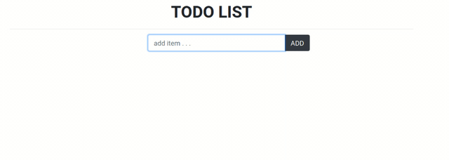

# todo-react

## reactJS

React is a JavaScript library used to develop interactive user interfaces. It is managed by Facebook and a community of individual developers and companies. React mainly focuses on developing single-page web or mobile applications. here, we will create a todo app to understand the basics of reactJS.

<a href="https://www.geeksforgeeks.org/how-to-create-todo-app-using-reactjs/" >How to Create ToDo App using ReactJS ?</a>

## Modules required

<ul>
<li> npm </li>
<li> React </li>
<li> React Bootstrap
<pre> npm install react-bootstrap bootstrap</pre>
</li>
</ul>

---
 

  

